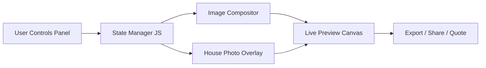

# Custom Garage Door Configurator — Research & Action Plan

> [!IMPORTANT]
> **Status: PAUSED** — Waiting on brand design (colors, style, logo) for Majestic Garage Doors before building.
> Next step: Design the overall website brand, then return here to build the configurator.

## Competitive Deep Dive

I thoroughly inspected both Amarr and Garaga's configurator tools. Here's exactly how each one works, their strengths, their weaknesses, and how we can beat them both.

---

### 🔵 Amarr — "Design Your Garage Door"
**URL:** [amarr.com/us/en/design-your-garage-door](https://www.amarr.com/us/en/design-your-garage-door)

#### UX Flow — 4-Step Wizard

| Step | Name | What Happens |
|------|------|-------------|
| **1** | **Door Size** | User selects # of garage doors (1–4), then picks Width × Height from dropdowns |
| **2** | **Home Image** | User uploads their own home photo OR picks from 6 sample home photos |
| **3** | **Design Door** | The main configurator — door preview composited onto the home photo. Sidebar with: Door Collection, Door Design, Color, Window Placement, Window Design, Construction, Decorative Hardware |
| **4** | **Review & Save** | Before/After comparison, specification summary, actions: Add to Favorites, Save as PDF, Print, Email, **Request a Quote** |

#### How the Visualization Works
- **Image compositing onto a house photo** — Amarr takes the selected home image and composites the configured door directly into the garage opening
- The door image is a **pre-rendered product photo that swaps** when selections change (not SVG or canvas — it's swapping `` `src` attributes to different product photography)
- Each combination of `Collection + Design + Color + Windows` maps to a specific pre-photographed/pre-rendered image asset
- The door image is **positioned and scaled** over the house photo's garage area using CSS absolute positioning

#### Strengths
- ✅ The home photo context is powerful — seeing your door "on your house" is extremely compelling
- ✅ Before/After comparison at the end is a great sales tool
- ✅ Clean 4-step wizard structure reduces overwhelm

#### Weaknesses
- ❌ Dated UI — feels like a 2015 website (plain dropdowns, no animations, static layout)
- ❌ No real-time preview during Step 1 & 2 — you don't see anything until Step 3
- ❌ Color picker uses small thumbnail swatches — hard to see texture/grain detail
- ❌ No price indication anywhere
- ❌ Navigation feels sluggish — lots of page-style transitions

---

### 🔴 Garaga — "Design Centre"
**URL:** [garaga.com/ca/designcentre/selection](https://www.garaga.com/ca/designcentre/selection)

#### UX Flow — Single Page with Dropdowns

All options are presented on **one page**, no wizard steps:

| Option | Type | Values |
|--------|------|--------|
| **Door dimension** | Dropdown | Single door (9' × 7'), Double (16' × 7'), etc. |
| **Panel construction** | Dropdown | Standard+, Premium, etc. |
| **Panel design** | Dropdown | Classic CC, North Hatley LP, Shaker-Flat XL, etc. |
| **Color** | Dropdown with texture swatches | Solid colors (Ice White, Desert Sand, Claystone, Dark Sand, Moka Brown, etc.) and Wood tones |
| **Decorative hardware** | Dropdown | None or hardware options |
| **Windows** | Dropdown with visual previews | No windows, 4th row, 3rd row, Select row |

#### How the Visualization Works
- **Pre-rendered product images that swap** — the door image on the right is a single `` element that changes its `src` when any dropdown value changes
- The image URL follows a naming convention that encodes the selections (model + color + windows + size)
- **No house context** — it's just the door floating on a plain light-gray background
- There's an **"Apply to my home"** feature that appears to let you upload a photo separately

#### Output Actions
- Save it in PDF
- **Get your quote** (primary red CTA)
- Add to Wish List
- Apply to my home (photo upload)
- Email it

#### Strengths
- ✅ All options visible at once — no multi-step navigation
- ✅ Color dropdown shows actual texture/grain photography — very helpful
- ✅ Fast — changing any dropdown instantly swaps the image
- ✅ "Apply to my home" is a nice secondary feature

#### Weaknesses
- ❌ The door floats on a blank background — lacks real-world context
- ❌ Very plain, form-like UI — looks like a generic e-commerce product page
- ❌ No visual progress indicator or sense of "building" something
- ❌ Dropdown-heavy — not visually engaging (you can't see options without opening each dropdown)
- ❌ No Before/After or side-by-side comparison

---

## How the Image Rendering Actually Works (The Secret Sauce)

Both sites use the same fundamental technique:

### Pre-rendered Image Swapping
Neither site generates images in real-time. They pre-photograph or pre-render every combination and swap `` src attributes.

**How it works:**
1. A photographer/3D artist creates an image of every door variant (model × color × windows × size)
2. These are named with a systematic convention like: `classica_tuscany_white_closed-square_8x7.png`
3. When the user changes a dropdown, JavaScript constructs the new image filename and updates `src`

**Why they do it this way:**
- Photorealistic quality — real product photos look better than runtime compositing
- Simple to implement — just image swaps, no complex rendering engine
- But it has a scaling problem: if you have 10 colors × 8 designs × 5 window styles × 4 sizes = **1,600 images**

### The Better Approach: Layered PNG Compositing

Instead of pre-rendering every combination, we can use a **layered approach** that's far more scalable:

```
Layer Stack (bottom to top):
─────────────────────────────
Layer 5:  Decorative Hardware overlay (transparent PNG)
Layer 4:  Window style overlay (transparent PNG)  
Layer 3:  Color/texture overlay (transparent PNG, blended)
Layer 2:  Panel design/pattern (transparent PNG)
Layer 1:  Base door frame (transparent PNG)
Layer 0:  House background image
```

Each layer is a **transparent PNG** with identical dimensions. They stack using CSS `position: absolute` or HTML5 Canvas `drawImage()`. When the user changes "Color," we only swap **Layer 3**. When they change "Windows," only **Layer 4** changes.

> [!IMPORTANT]
> **Asset math:** Instead of 1,600 pre-rendered combos, you need: 1 base + 8 panel designs + 10 color overlays + 5 window options + 4 hardware options = **~28 images total**. Massive reduction.

---

## Proposed Plan — How We Build Ours (Better)

### Architecture Overview



---

### Phase 1: Asset Preparation & Data Modeling
**The most critical phase — everything depends on quality assets.**

- [ ] **Identify your product catalog** — which door models, colors, window styles, and hardware you want to offer
- [ ] **Create the layered image assets:**
  - Base door frames for each model (transparent PNG, consistent canvas size — e.g., 1200 × 900px)
  - Panel design overlays for each style
  - Color/texture overlays (using multiply blend mode or pre-colored variants)
  - Window style overlays for each row position
  - Decorative hardware overlays (handles, hinges, straps)
- [ ] **Create the product data model** (JSON):
```json
{
  "collections": [
    {
      "id": "modern",
      "name": "Modern Collection",
      "designs": [
        {
          "id": "flush-panel",
          "name": "Flush Panel",
          "colors": ["matte-black", "charcoal", "white", "natural-oak"],
          "windows": ["none", "top-row", "second-row", "full-view"],
          "hardware": ["none", "contemporary-handles", "minimalist-pulls"]
        }
      ]
    }
  ]
}
```
- [ ] **Photograph/render house context images** — 4–6 home styles with clearly defined garage door areas (masked regions)

---

### Phase 2: Core Configurator Engine
**Build the image rendering and state management.**

#### Option A: CSS Layer Stacking (Recommended to Start)
```
<div class="door-preview" style="position: relative;">
  
    
  
  
  
</div>
```
- All layers share the same dimensions, stacked via `position: absolute`
- JavaScript swaps individual `src` attributes when options change
- Smooth crossfade transitions via CSS `opacity` + `transition`

#### Option B: HTML5 Canvas (For Advanced Effects)
- Draw layers programmatically onto a `<canvas>` element
- Enables blend modes (multiply for color overlays), dynamic scaling, and easy export to PNG/PDF
- Libraries like **Fabric.js** can simplify this significantly
- Better for the "Apply to my home" feature where you need to composite the door onto a photo

> [!TIP]
> **Recommendation:** Start with CSS layer stacking for the MVP. It's faster to build, easier to debug, and performs great. Migrate to Canvas later if you need advanced compositing (like the house photo overlay).

---

### Phase 3: UI / UX Design — Where We Beat the Competition

Both Amarr and Garaga have **dated, form-heavy UIs**. This is where we win:

#### Layout: Split-Screen Configurator
```
┌─────────────────────────────────────────────────────┐
│  HEADER / BRAND BAR                                  │
├────────────────────────┬────────────────────────────┤
│                        │                            │
│   LIVE DOOR PREVIEW    │    CONFIGURATION PANEL     │
│   (60% width)          │    (40% width)             │
│                        │                            │
│   ┌──────────────┐     │  ┌────────────────────┐    │
│   │              │     │  │ Step Indicator      │    │
│   │  Composited  │     │  ├────────────────────┤    │
│   │  Door Image  │     │  │ Visual Option Cards │    │
│   │  (on house)  │     │  │ (not dropdowns!)   │    │
│   │              │     │  │                    │    │
│   └──────────────┘     │  │ Color swatches     │    │
│                        │  │ Window thumbnails  │    │
│   [Before/After Slider]│  │ Hardware thumbnails│    │
│                        │  └────────────────────┘    │
│                        │  [Next Step / Get Quote]   │
├────────────────────────┴────────────────────────────┤
│  PROGRESS BAR / STEP INDICATOR                       │
└─────────────────────────────────────────────────────┘
```

#### Key UX Upgrades Over Competition

| Feature | Amarr | Garaga | **Ours** |
|---------|-------|--------|----------|
| Option selection | Dropdowns | Dropdowns | **Visual cards/swatches with hover previews** |
| Live preview | Only in Step 3 | Always visible | **Always visible with smooth transitions** |
| House context | ✅ Upload or sample | ❌ Plain background | **✅ Upload, sample homes, OR house style picker** |
| Color selection | Small swatches | Dropdown with textures | **Large swatches with zoom-on-hover + texture detail** |
| Before/After | End only | ❌ None | **Interactive slider available anytime** |
| Animations | ❌ None | ❌ None | **✅ Smooth crossfades, micro-interactions** |
| Mobile UX | Basic responsive | Basic responsive | **✅ Bottom sheet configurator, swipe gestures** |
| Dark mode | ❌ | ❌ | **✅ Premium dark UI option** |
| Share | PDF, Email | PDF, Email | **✅ PDF, Email, shareable link, social cards** |

#### Design Language
- **Dark mode default** with glassmorphism panels for the controls
- Visual option selection with image cards instead of dropdowns
- Smooth crossfade transitions when options change (300ms CSS transition)
- Subtle parallax on the house photo behind the door
- Animated progress indicator showing completion
- Before/After **wiper slider** (drag a handle left/right to compare)

---

### Phase 4: "Apply to My Home" Feature

This is the killer feature that makes your configurator stand out:

1. User uploads a photo of their house
2. They draw/drag a rectangle over their garage door area
3. The configured door is composited into that rectangle with perspective correction
4. **Implementation:** HTML5 Canvas with `drawImage()` + CSS `transform: perspective()` for basic skew matching

> [!NOTE]
> For a proper perspective-correct composite, you'd need a 4-point perspective transform. Libraries like **perspective.js** or a Canvas-based approach can handle this. For MVP, just scaling the door into the rectangle works great.

---

### Phase 5: Output & Lead Capture

| Action | Description |
|--------|-------------|
| **Save as PDF** | Generate a styled spec sheet with door image, all selections, and dealer contact info |
| **Request a Quote** | Form overlay → captures name, email, phone, address → sends configuration data to backend/CRM |
| **Share Link** | Encode configuration into URL params so anyone can open the exact same configuration |
| **Email** | Pre-formatted email with configuration image and specs |
| **Shareable Social Card** | Auto-generate an OG image of the configured door for link previews |

---

### Phase 6: Polish & Premium Touches

- **Loading shimmer** while assets load (skeleton UI)
- **Keyboard navigation** for accessibility
- **Responsive breakpoints** — on mobile, preview stacks above the controls
- **Lazy-load** image assets (only load colors/options when that step is active)
- **History state** — browser back button navigates between steps, not off the page
- **Local storage** — auto-save configuration so returning visitors see their last design

---

## Tech Stack Recommendation

| Layer | Technology | Why |
|-------|-----------|-----|
| **Structure** | HTML5 | Semantic, accessible |
| **Styling** | Vanilla CSS + CSS Custom Properties | Full control, no framework overhead |
| **Logic** | Vanilla JavaScript (ES6+) | Lightweight, no build step needed |
| **Image Compositing** | CSS Layers → Canvas API (Phase 2) | Start simple, upgrade when needed |
| **PDF Generation** | html2canvas + jsPDF | Client-side PDF from the canvas |
| **Image Hosting** | Local `/assets/` directory | Self-contained, fast |

> [!IMPORTANT]
> **No React, no Vue, no build tools needed.** This is fundamentally a layer-swapping UI with some dropdown logic. Vanilla HTML/CSS/JS will be faster, lighter, and easier to maintain. We can always add a framework later if the project grows.

---

## Summary: What Makes Ours Better

1. **Visual card selection** instead of boring dropdowns — users see options, not text
2. **Always-visible live preview** with smooth transitions — not hidden behind wizard steps
3. **Premium dark-mode UI** with glassmorphism — makes it feel like a luxury product tool
4. **Before/After wiper slider** — available anytime, not just at the end
5. **Smarter asset system** — layered PNGs instead of 1,600 pre-rendered combos
6. **House context built-in** — sample homes + upload your own
7. **Shareable links** — encode the configuration in the URL for easy sharing
8. **Mobile-first** — bottom sheet controls, swipe-friendly options

---

## Answered Questions

1. **Product catalog** — We'll create all layer assets from scratch. Will need to establish a repeatable skill/template for generating them at consistent sizes, styles, and formats so every layer aligns perfectly.

2. **House context images** — Will need to create mock sample house images as well.

3. **Branding** — The business is called **Majestic Garage Doors**. Brand colors, style guide, and logo are TBD — this is the next priority before building the configurator.

4. **Scope of V1** — Simple live door builder preview + a summary of selections after clicking "Request a Quote." No house upload, no Before/After slider, no PDF export in V1.

5. **Lead capture** — Quote request form captures name, contact info, and all door selections → sends an email with the full submission details. No CRM integration needed for now.

## Approach: Single-Page Configurator

> User preference confirmed: **Single-page layout** like Garaga (all controls visible, instant preview updates) — NOT a multi-step wizard like Amarr. Our version uses visual cards/swatches instead of Garaga's plain dropdowns.
